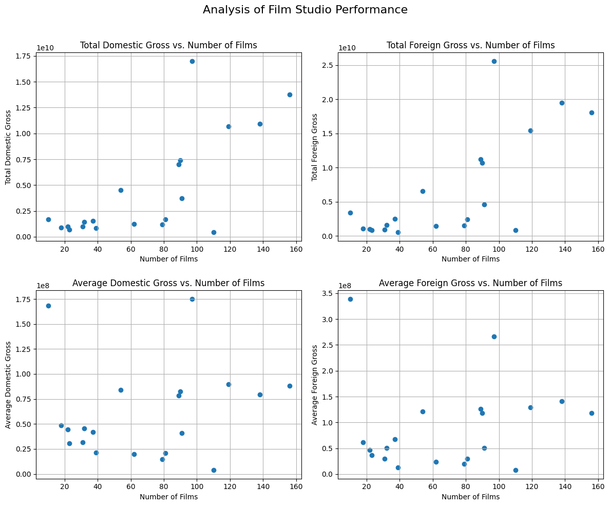
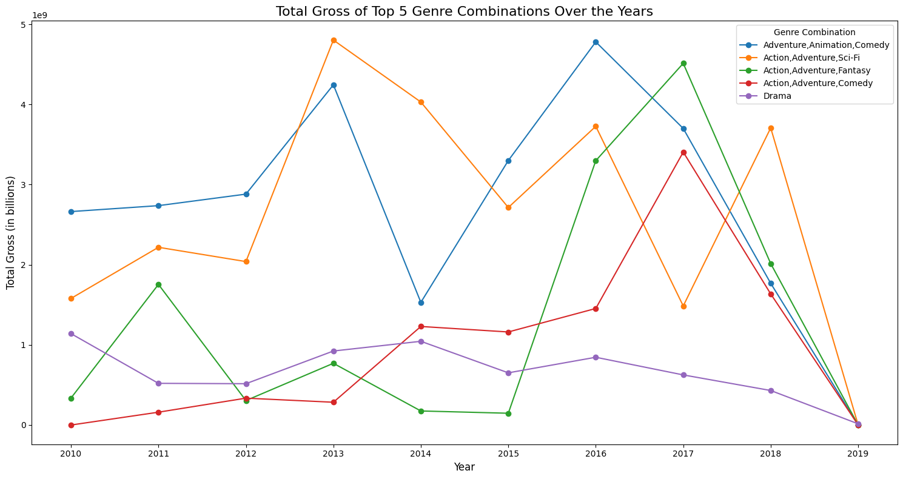
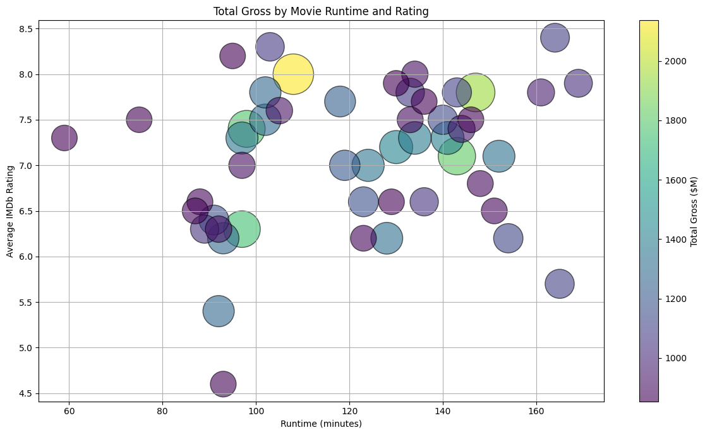

# Microsoft's entrance to film analysis

**Author:** [Calvin Mbugua](https://mbuguaaaaaa.xyz/mbuguaaaaaa-initial)
***

# Overview

Microsoft is undoubtedly one of the biggest corporations in the world, and after revolutionizing the PC space, they have decided to take up a new challenge, and that is the film industry — and this is what this notebook aims to do. In this notebook is a comprehensive analysis of the top movies across time to get a better sense of what they are getting into.

## Bussiness Problem

Microsoft is a major corporation, and as they venture into the film industry, they need a top-down analysis of the most successful titles to understand where and how to channel their resources effectively. The goal is to produce impactful films that resonate with audiences and stand the test of time. This analysis will help identify what types of films are currently performing best at the box office and provide actionable insights to guide the decisions of Microsoft's new movie studio.

## Data

There is an abundance of data sources that are in the publc domain in which we can use in this analysis but in this analysis we will use datasets from [IMDB](https://www.imdb.com/) and [Box Office Mojo](https://www.boxofficemojo.com/) specifically: 
- imdb.title.basics
- imdb.title.ratings
- bom.movie_gross

### Methods and Exploration

For an indepth analysis of the dataset, the cleaning and analsysis of the datasets was done in a separate notebook eda/exploration.ipynb as to not make this one long.

Inorder to explore the data i sought out to find questions that resonate with the bussiness problem at habd and they were:
1. Most successful film studios in the industry
2. Most successful genres in the industry
3. Trends in genres over the years
4. Typical Runtime of a succesful film

I used two key methods of analysis on the dataset above:

**Statistical analysis**: For certain questions like *succesful studios* and *typical runtime* i sought out to use covariance to see what is the success rate of a studio in regards to the number of films produced and median to see the typical runtime of a successful film

**Visual analysis**: All questions have some form of visualization that is to answer the respective question

---

### Results

The results are based on the four questions above:

#### 1. Succesful Studios

The above is a figure containing 4 scatter plots divided into two groups and two sub groups:

1. Total Gross:
In this we can see an almost identical correlation between the gross value of a film studio and the number of fils that studio has given out. (Domestic Gross: 0.73, Foreign Gross: 0.72) this suggests that the two have a strong assosiation

2. Average Gross:
In this, they are almost similar but here rather they have a week correlation coeficient (Domestic Gross: 0.14, Foreign Gross: 0.10)

---

#### 2. Popular Genres

In this i decided to sample the top 20 genre categories and use 3 of them in here:

The above visualisation contains three plots:

- Average Ratings: The top genres include

1. Adventure, Drama, sci-fi
2. Action, Comedy, Fantacy
3. Mystery, sci-fi, thriller

- Average Votes: (this is where most film heads are)

1. Adventure, Drama, sci-fi
2. Adventure, mystery, sci-fi
3. Action, Adventure, sci-fi

- Total Gross

1. Action, Adventure, sci-fi
2. Action, Adventure, fantacy
3. Action, Adventure, Thriller

---

#### 3. Trends over time

From the above visualisation we can see that `Adventure, Animation, Comedy` and `Action, Adventure, sci-fi` have been leading consistently over the span of nine years in terms of gross

---

#### 4. Runtime of a succesful film

The median of a typical succesful film is:

Median Rating: 7.3

Median Runtime: 126.0

Median Gross: 1076004500.0

---

## Conclutions

From the results obtained, it is safe to reccomend:

- For the specific category, i highly recomend starting out with a mix the following as they are the most prommising:

1. Action
2. Adventure
3. Sci-Fi
4. Drama
5. Fantancy
6. Thriller

- For Runtime of a succesful film they should try and keep their runtime in the range of `120 - 130` minutes

- For Relevant genre they should focus on `Adventure`, `Action`, `Sci-Fi`

**Final Recomendation**: The data itself testifies that the most promissing places to start is `Action` `Adventure` and `Sci-Fi`.

### More

An indepth analysis can be found at `eda/exploration.ipynb`.

Visualizations at `images/`.

Datasets at `data`.

repository structure

eda/
....data/
........bom.movie_gross.csv
........im.db

....exploration.ipynb

images/
....5 images

README.md
